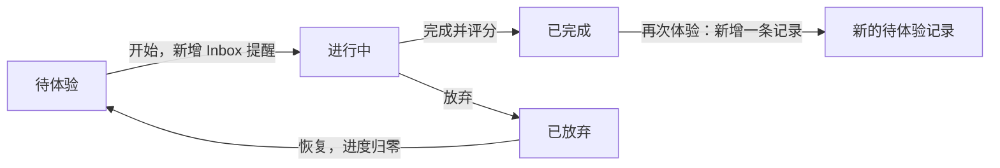

# Journey：作品体验记录

[返回总览](../../README.md) · [详细用例](use-cases.md)

Journey 管理电影、剧集、纪录片、书籍、游戏和漫画的“想体验 → 正在体验 → 完成后回顾”。数据库模型沿用 Watch 名称，但前端会根据作品类型展示继续观看、阅读或游玩。

## 页面与数据

| 视图     | 条件                   | 展示与操作                                                 | 截图                                               |
| -------- | ---------------------- | ---------------------------------------------------------- | -------------------------------------------------- |
| Watching | `status=Watching`      | 封面卡片、作品信息、进度、继续链接、编辑、完成 / 放弃      | [Watching](../../screenshots/Journey-Watching.png) |
| To Watch | `status=Plan to Watch` | 类型 / 名称 / 作者表格，新增、筛选、置顶、开始、删除       | [To Watch](../../screenshots/Journey-ToWatch.png)  |
| Watched  | `status=Completed`     | 已完成表格、评分、完成日期、感想、再次体验、分享           | [Watched](../../screenshots/Journey-Watched.png)   |
| Dropped  | `status=Dropped`       | 从 To Watch 下方归档图标进入的弹框，查看放弃项、感想及恢复 | 无单独截图                                         |
| 分享预览 | 某条已完成记录         | 封面、评分、作者、用户、完成日期和感想                     | [Share](../../screenshots/Journey-Share.png)       |

`d_watch` 是所有视图的主表。`payload.review` 和 `payload.quotes` 指向 `d_tiptap`；封面及正文附件可依赖 `d_media`；分享卡读取 `d_user`。开始体验还会新增一条 `d_todo` Inbox 提醒。

## 作品信息与进度

| 字段                                 | 用户含义                                                              |
| ------------------------------------ | --------------------------------------------------------------------- |
| `title / author / w_type`            | 名称、作者 / 主创和六种作品类型                                       |
| `year`                               | 作品发行年份；未填写的默认值 2099 通常不展示                          |
| `rate`                               | 0–20 的整数评分；显示为 0–10 分，0.5 分一档                           |
| `created_at`                         | 在不同状态中承担加入 / 开始 / 完成 / 排序时间，不能当作不可变创建时间 |
| `payload.img / link`                 | 封面与继续体验的外部链接                                              |
| `payload.measure / range / progress` | 进度单位、总量、当前累计量                                            |
| `payload.checkpoints`                | `[YYYY-MM-DD, 累计进度]`，特殊进度 -1 表示放弃                        |
| `payload.epoch`                      | 第几次体验；界面可显示 2nd 等标记                                     |
| `payload.review / quotes`            | 感想和摘录的独立正文引用                                              |

进度单位有 Chapter、Episode、Minute、Page、Percentage、Trophy、Volume。该页面不内置播放器、阅读器或游戏运行器；“继续”打开用户保存的链接。

## 状态流转

还可以直接在 Watched 新增历史完成记录，补填完成日期和评分，不必走 Watching。再次体验保留旧的完成记录，不把它改回未完成。

## 列表检索

To Watch 支持名称 / 作者文本过滤与类型筛选；Watched 另有评分档和年份筛选。这里的年份筛选来自完成记录 `created_at` 的年份，不是作品发行 `year`。筛选、分页在前端执行，后端按状态加载记录并按 `created_at DESC` 排序。桌面默认每页 10 条，移动端根据高度计算初始页大小。

源码：[Journey 页面](../../../../third_party/dashboard/client/src/pages/Journey.tsx)、[数据类型和状态操作](../../../../third_party/dashboard/client/src/hooks/use-watches.ts)、[表格列与过滤](../../../../third_party/dashboard/client/src/components/react-table/data-table-columns.tsx)、[Watch 模型](../../../../third_party/dashboard/model/watch.go)。
