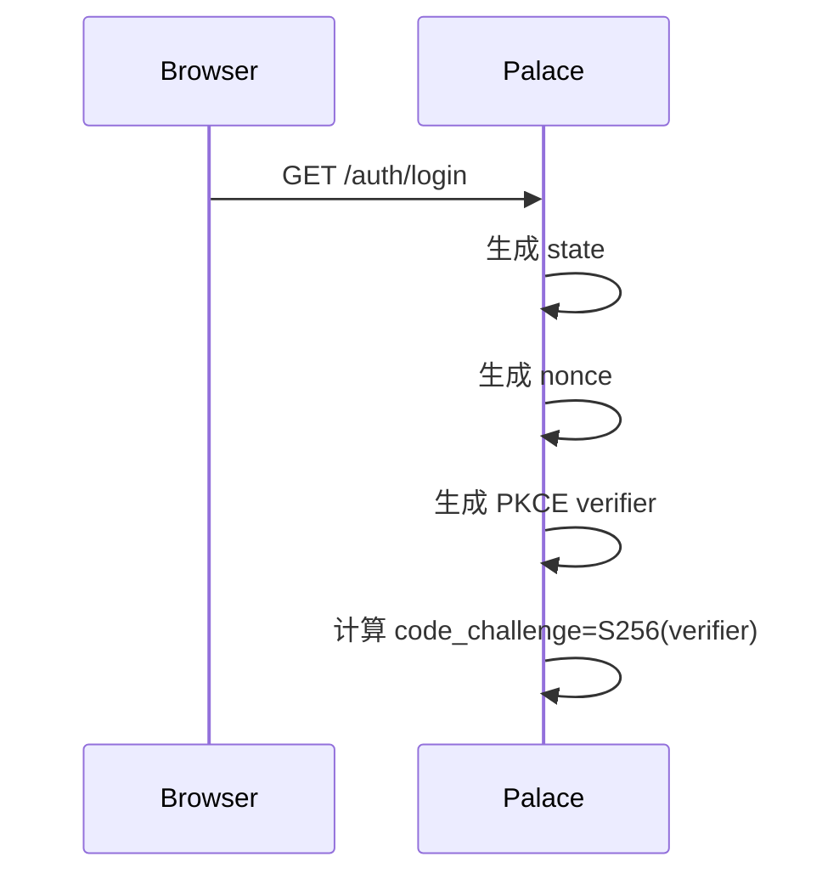
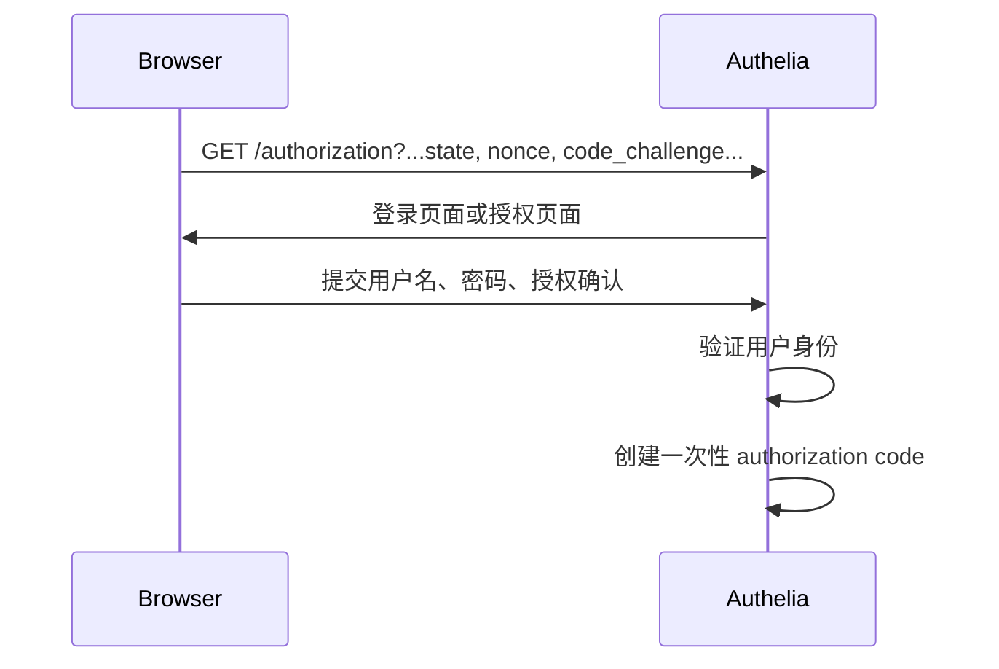
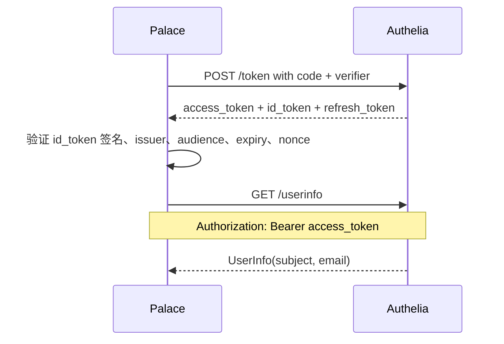
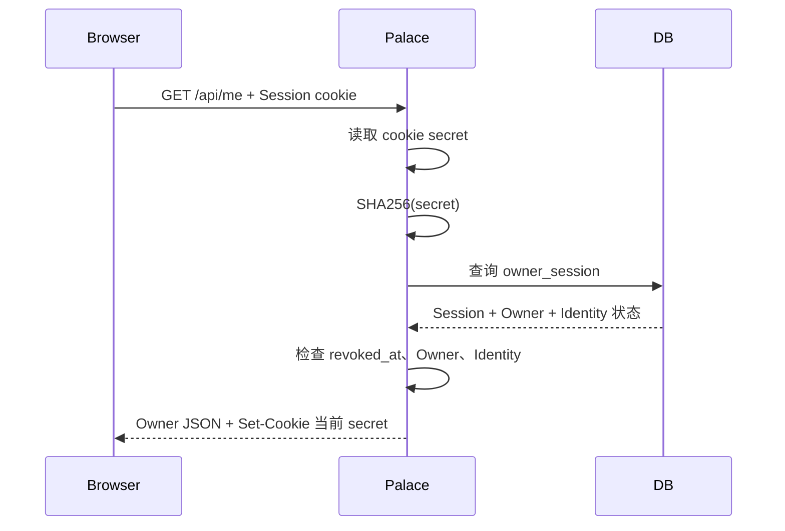
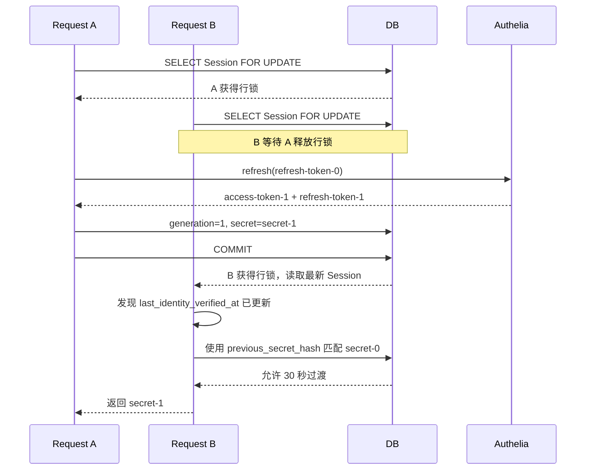
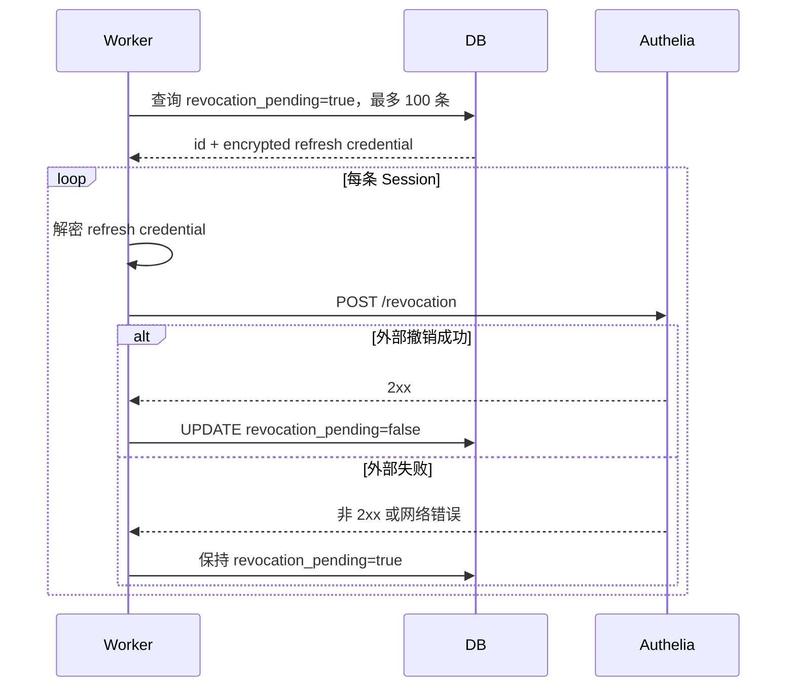
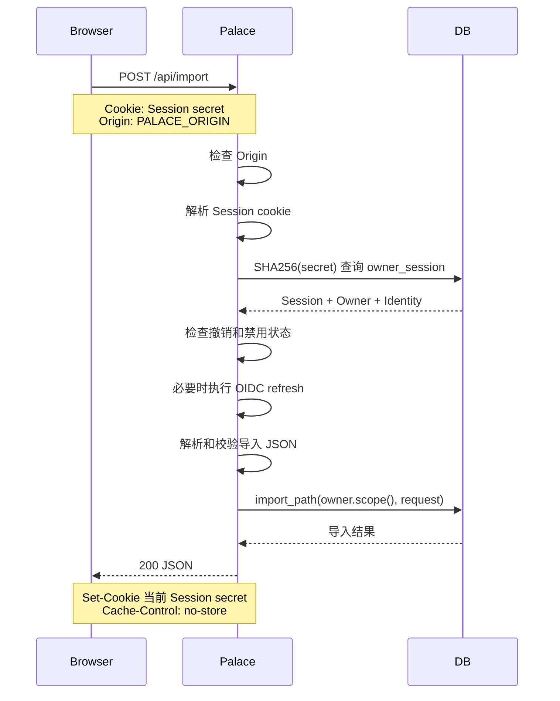

先建立几个角色：

```text
Browser       用户浏览器
Palace        Palace HTTP Server
DB            PostgreSQL
Authelia      OIDC Identity Provider
Worker        Palace 后台撤销重试任务
```

## 0. 先理解 Palace 保存的三类东西

```text
浏览器：
  __Host-palace-login     临时登录绑定 cookie
  __Host-palace-session   长期 Palace Session cookie

Palace 数据库：
  oidc_login              登录过程中的临时状态
  owner                   Palace 内部用户
  owner_identity          外部 OIDC 身份
  owner_session           Palace 长期 Session

Authelia：
  用户登录状态
  authorization code
  access token
  ID token
  refresh token
```

浏览器不会保存：

```text
OIDC refresh token
OIDC access token
OIDC ID token
Palace Owner ID
```

浏览器只保存 Palace 生成的 opaque secret。

---

# 一、第一次登录

假设用户第一次访问 Palace，还没有任何 cookie。

## 1. 浏览器请求登录入口



Palace 生成四个关键值：

```text
state
nonce
verifier
code_challenge
```

其中：

```text
state
  -> 标识本次登录流程，防止 callback 被伪造

nonce
  -> 后面放进 ID token 校验，防止 token 跨流程复用

verifier
  -> 只有 Palace 保存，不能暴露给 Authelia 之前以外的其他方

code_challenge
  -> verifier 的公开摘要，发送给 Authelia
```

## 2. Palace 保存登录状态

Palace 另外生成一个浏览器绑定值：

```text
browser_binding
```

然后把登录信息保存到 PostgreSQL：

```text
oidc_login
├── id
├── state_hash = SHA256(state)
├── browser_hash = SHA256(browser_binding)
├── encrypted_proof = Encrypt(nonce + verifier)
└── expires_at = now + 600 秒
```

完整关系是：

```text
state
  -> state_hash

browser_binding
  -> browser_hash

nonce + verifier
  -> encrypted_proof
```

Palace 不把明文 state、browser binding 或 verifier 存入数据库。

## 3. Palace 返回临时 cookie 和 OIDC 跳转

Palace 返回一个 HTTP 302：

```http
HTTP/1.1 302 Found
Location: https://auth.example.com/api/oidc/authorization?... 
Set-Cookie: __Host-palace-login=<browser_binding>;
            Path=/;
            Secure;
            HttpOnly;
            SameSite=Lax;
            Max-Age=600
```

浏览器收到后：

```text
保存 __Host-palace-login
自动跳转 Location
```

此时这个 cookie 只存在于 Palace 域名下，不会发送给 Authelia。

## 4. Palace 发给 Authelia 的 authorization 请求

请求大致包含：

```text
GET https://auth.example.com/api/oidc/authorization
    ?client_id=palace
    &redirect_uri=https://palace.example.com/auth/callback
    &response_type=code
    &scope=openid%20profile%20email%20offline_access
    &state=<state>
    &nonce=<nonce>
    &code_challenge=<S256(verifier)>
    &code_challenge_method=S256
```

关键字段：

| 字段 | 作用 |
| --- | --- |
| `client_id` | 告诉 Authelia 是哪个 OIDC client |
| `redirect_uri` | 登录完成后的回调地址 |
| `response_type=code` | 使用 Authorization Code Flow |
| `scope=openid` | 请求 OIDC 身份认证 |
| `scope=profile email` | 请求用户资料和 email |
| `scope=offline_access` | 请求长期 refresh token 能力 |
| `state` | 绑定本次登录流程 |
| `nonce` | 绑定本次 ID token |
| `code_challenge` | PKCE 公开校验值 |
| `code_challenge_method=S256` | 指定 PKCE 算法 |

## 5. 用户在 Authelia 完成认证



此时 Palace 不参与用户名密码校验。用户名和密码只交给 Authelia。

Authelia 生成 authorization code，并准备跳回 Palace。

## 6. Authelia 回调 Palace

Authelia 返回：

```http
HTTP/1.1 302 Found
Location: https://palace.example.com/auth/callback
          ?code=<authorization-code>
          &state=<state>
```

浏览器访问 callback 时，会自动带上之前的 Palace 登录 cookie：

```http
GET /auth/callback?code=<code>&state=<state>
Cookie: __Host-palace-login=<browser_binding>
```

此时 callback 同时携带：

```text
URL 中的 state
URL 中的 code
浏览器中的 __Host-palace-login
```

---

# 二、Palace 处理第一次 callback

## 1. 读取 callback 参数和登录 cookie

Palace 读取：

```text
code
state
__Host-palace-login
```

如果出现以下情况，流程立即失败：

```text
缺少 code
缺少 state
缺少 __Host-palace-login
cookie 格式非法
cookie 重复出现
```

## 2. 原子消费登录状态

Palace 执行：

```sql
DELETE FROM oidc_login
WHERE state_hash = SHA256(:state)
  AND browser_hash = SHA256(:browser_binding)
  AND expires_at > :now
RETURNING id, encrypted_proof;
```

匹配成功后：

```text
删除 oidc_login 记录
取回 encrypted_proof
解密得到 nonce + verifier
```

这一步的意义是：

```text
正确 state
+ 正确浏览器
+ 未过期
+ 只能使用一次
```

如果 callback 被重复发送：

```text
第一次 callback -> DELETE 成功
第二次 callback -> 找不到记录 -> 401
```

## 3. Palace 向 Authelia 的 token endpoint 换 token

Palace 发送大致请求：

```http
POST https://auth.example.com/api/oidc/token
Authorization: Basic base64(client_id:client_secret)
Content-Type: application/x-www-form-urlencoded

grant_type=authorization_code
&code=<authorization-code>
&redirect_uri=https://palace.example.com/auth/callback
&code_verifier=<verifier>
```

`code_verifier` 没有放在浏览器 callback URL 里，而是从数据库解密出来的 proof 中取得。

Authelia 检查：

```text
authorization code 是否有效
code 是否属于 palace client
redirect_uri 是否匹配
S256(verifier) 是否等于之前的 code_challenge
client authentication 是否正确
```

成功后返回类似：

```json
{
  "access_token": "access-token",
  "token_type": "Bearer",
  "expires_in": 300,
  "refresh_token": "refresh-token",
  "id_token": "signed.jwt"
}
```

## 4. Palace 验证 ID token

Palace 不会因为 token endpoint 返回成功就直接信任结果，而是验证 ID token：

```text
JWT 签名
issuer
audience
过期时间
nonce
可选 at_hash
subject
```

其中：

```text
nonce
  -> 必须等于本次登录开始时保存的 nonce

at_hash
  -> 如果 ID token 带有 at_hash，必须匹配本次返回的 access_token
```

验证失败：

```text
不创建 Owner
不创建 Session
返回 authentication_required
```

## 5. Palace 取得 email 和身份

在 `d7624ea` 当时，email 从 ID token 读取。

后续 `4c01179` 修正后，实际流程是：



UserInfo 请求大致是：

```http
GET https://auth.example.com/api/oidc/userinfo
Authorization: Bearer <access-token>
```

Palace 得到：

```text
issuer
subject
email
refresh credential
```

refresh credential 不是只保存 refresh token，而是会保存：

```json
{
  "token": "refresh-token",
  "nonce": "...",
  "subject": "user-123"
}
```

然后整体加密保存。

---

# 三、创建第一次 Palace Session

## 1. 根据 OIDC 身份查找或创建 Owner

Palace 使用：

```text
(issuer, subject)
```

查询 `owner_identity`。

第一次登录时没有记录，于是：

```text
创建 Owner
创建 Owner Identity
建立两者关系
```

可以理解为：

```text
Authelia:
  issuer  = https://auth.example.com
  subject = user-123

Palace:
  owner_id = Palace 内部 UUID
  identity_id = Palace 内部 UUID
```

email 只用于当前用户资料和冲突检查，不作为稳定身份主键。

## 2. 生成 Session

Palace 生成：

```text
session_id = 随机 UUID
generation = 0
```

然后计算：

```text
secret = HMAC-SHA256(
    PALACE_SESSION_KEY,
    "palace-session-v1\0" + session_id + generation
)
```

数据库保存：

```text
secret_hash = SHA256(secret)
```

refresh credential 保存为：

```text
encrypted_refresh_credential =
    AES-256-GCM(
        key = PALACE_SESSION_KEY,
        aad = session_id,
        plaintext = serialized refresh credential
    )
```

## 3. 写入 `owner_session`

大致记录：

```text
owner_session
├── id = session_id
├── owner_id
├── owner_identity_id
├── secret_hash
├── generation = 0
├── refresh_credential = encrypted value
├── created_at
├── last_seen_at
├── last_identity_verified_at
├── rotated_at
└── revoked_at = NULL
```

## 4. 返回新的 Session cookie

Palace 返回：

```http
HTTP/1.1 302 Found
Location: /
Cache-Control: no-store
Set-Cookie: __Host-palace-session=<secret>;
            Path=/;
            Secure;
            HttpOnly;
            SameSite=Lax;
            Max-Age=15552000
Set-Cookie: __Host-palace-login=;
            Path=/;
            Secure;
            HttpOnly;
            SameSite=Lax;
            Max-Age=0
```

两个 `Set-Cookie` 的作用：

```text
__Host-palace-session
  -> 写入长期 Palace Session

__Host-palace-login
  -> 删除临时登录状态 cookie
```

浏览器最终只保留：

```text
__Host-palace-session=<opaque-secret>
```

---

# 四、后续访问 `/api/me`

登录成功后，浏览器访问：

```http
GET /api/me
Cookie: __Host-palace-session=<secret>
```

Palace 的处理过程：



返回：

```json
{
  "id": "owner-uuid",
  "email": "user@example.com",
  "identity_id": "identity-uuid"
}
```

同时返回当前 Session cookie：

```http
Set-Cookie: __Host-palace-session=<current-secret>; ...
Cache-Control: no-store
```

如果 secret 没有变化，浏览器会再次保存同一个值，并把 cookie 的浏览器有效期滚动到 180 天。

---

# 五、后续登录

这里的“后续登录”指用户再次访问 `/auth/login`，而浏览器已经携带旧 Session。

## 1. 登录过程和第一次基本相同

Palace 再次：

```text
生成新的 state
生成新的 nonce
生成新的 PKCE verifier
生成新的 browser binding
保存新的 oidc_login
设置新的 __Host-palace-login
跳转 Authelia
```

旧 Session cookie 也可能一起存在：

```http
Cookie:
  __Host-palace-session=<old-secret>;
  __Host-palace-login=<new-browser-binding>
```

## 2. OIDC 认证成功后创建新 Session

Palace 完成 callback、token 校验和 Owner 查找后：

```text
创建新的 session_id
创建新的 secret
创建新的 owner_session
```

如果 callback 请求里存在旧 Session，Palace 将它作为 `previous` 处理。

## 3. 撤销旧 Session

数据库更新：

```sql
UPDATE owner_session
SET revoked_at = :now,
    revoke_reason = 'login rotation',
    revocation_pending = true
WHERE secret_hash = SHA256(:old_secret)
  AND revoked_at IS NULL;
```

结果：

```text
旧 Session -> 已撤销
新 Session -> 有效
```

然后返回：

```http
Set-Cookie: __Host-palace-session=<new-secret>; ...
Set-Cookie: __Host-palace-login=; Max-Age=0; ...
```

这可以避免登录成功后，旧的匿名或旧登录 Session 继续存在。

---

# 六、24 小时后的 provider refresh

Palace Session 没有绝对过期时间，也不会因为用户 24 小时没访问就自动删除。

但是下一次受保护请求时，如果：

```text
now - last_identity_verified_at >= 86400 秒
```

就会触发 provider refresh。

## 1. 浏览器发起普通业务请求

```http
POST /api/import
Cookie: __Host-palace-session=<secret>
Origin: https://palace.example.com
Content-Type: application/json
```

## 2. Palace 查 Session 并加行锁

```sql
SELECT ...
FROM owner_session s
...
WHERE s.secret_hash = SHA256(:secret)
FOR UPDATE OF s;
```

这把锁保证同一 Session 的并发请求不会同时刷新 refresh token。

## 3. Palace 解密 refresh credential

```text
从 owner_session.refresh_credential 读取密文
  -> 使用 PALACE_SESSION_KEY 解密
  -> 验证 AES-GCM tag
  -> 使用 session_id 作为 AAD
  -> 得到 token、nonce、subject
```

如果解密失败，当前代码会视为认证失败或完整性错误。

## 4. Palace 请求 Authelia refresh

大致请求：

```http
POST https://auth.example.com/api/oidc/token
Authorization: Basic base64(client_id:client_secret)
Content-Type: application/x-www-form-urlencoded

grant_type=refresh_token
&refresh_token=<stored-refresh-token>
```

Authelia 返回：

```json
{
  "access_token": "new-access-token",
  "token_type": "Bearer",
  "expires_in": 300,
  "refresh_token": "new-refresh-token",
  "id_token": "new-signed.jwt"
}
```

`refresh_token` 可能返回，也可能不返回。

## 5. Palace 验证刷新结果

Palace 检查：

```text
新的 ID token 签名
issuer
audience
过期时间
subject 是否仍然等于原 subject
nonce 如果存在，是否等于原 nonce
at_hash 如果存在，是否匹配新的 access token
```

然后调用 UserInfo：

```http
GET /userinfo
Authorization: Bearer <new-access-token>
```

取得当前 email：

```json
{
  "sub": "user-123",
  "email": "new@example.com"
}
```

如果 subject 变化，或者 email 缺失/非法，身份复核失败。

## 6. 成功后轮换 Palace secret

Palace 在 Session 行锁和同一个事务中更新：

```text
generation: 0 -> 1
previous_secret_hash = secret_hash(secret-0)
previous_valid_until = now + 30 秒
secret_hash = SHA256(secret-1)
refresh_credential = encrypted(new refresh credential)
last_identity_verified_at = now
rotated_at = now
```

然后继续执行原来的业务请求。

返回响应：

```http
HTTP/1.1 200 OK
Set-Cookie: __Host-palace-session=<secret-1>; ...
Cache-Control: no-store
```

浏览器收到后用 `secret-1` 替代 `secret-0`。

---

# 七、并发请求同时触发 refresh

假设浏览器有两个标签页，同时发请求，都携带 `secret-0`。



结果：

```text
Authelia refresh 调用次数 = 1
两个请求都可以成功
两个响应都返回 secret-1
```

B 不会再次调用 provider，因为它拿到锁后看到：

```text
last_identity_verified_at 已经是最新
```

它只需要接受仍在 30 秒宽限期内的旧 secret。

如果旧 secret 超过 30 秒才重放：

```text
找不到有效 secret
返回 401
```

后续版本还增加了对已知旧 secret 重放的主动撤销和 secret 完整性检查。

---

# 八、provider 临时不可用

如果 refresh 时发生：

```text
网络失败
超时
HTTP 5xx
```

Palace 返回：

```http
HTTP/1.1 503 Service Unavailable
```

响应错误类似：

```json
{
  "error": "identity_unavailable"
}
```

Session 不会被撤销：

```text
revoked_at = NULL
```

也不会更新：

```text
last_identity_verified_at
```

下一次请求仍然可以重试 refresh。

原因是：

```text
provider 暂时不可用
不等于用户身份已经失效
```

---

# 九、provider 明确拒绝或身份不匹配

如果 Authelia 明确拒绝 refresh，例如：

```text
refresh token 失效
refresh token 被撤销
subject 改变
nonce 不匹配
ID token 签名失败
email 缺失
email 冲突
```

Palace 会在本地撤销 Session：

```text
revoked_at = now
revoke_reason = 'identity rejected'
revocation_pending = true
```

之后即使 provider 恢复，旧 Session 也不能继续使用。

返回：

```http
HTTP/1.1 401 Unauthorized
```

逻辑是：

```text
临时网络问题 -> 保留 Session
明确身份失败 -> 撤销 Session
```

---

# 十、当前设备退出

浏览器发送：

```http
POST /auth/logout
Origin: https://palace.example.com
Cookie: __Host-palace-session=<secret>
```

## 1. 校验 Origin

Palace 要求：

```text
Origin 必须存在
Origin 只能有一个
Origin 必须严格等于 PALACE_ORIGIN
```

否则：

```text
返回 403
不执行退出
```

## 2. 本地撤销 Session

Palace 根据 cookie 找到 Session，然后更新：

```text
revoked_at = now
revoke_reason = 'logout'
revocation_pending = true
```

这个数据库事务先提交。

## 3. 尝试外部撤销

Palace 尝试调用 Authelia revocation endpoint：

```http
POST https://auth.example.com/api/oidc/revocation
Authorization: Basic base64(client_id:client_secret)
Content-Type: application/x-www-form-urlencoded

token=<refresh-token>
token_type_hint=refresh_token
```

## 4. 清除浏览器 cookie

Palace 返回：

```http
HTTP/1.1 200 OK
Set-Cookie: __Host-palace-session=;
            Path=/;
            Secure;
            HttpOnly;
            SameSite=Lax;
            Max-Age=0
```

浏览器删除本地 cookie。

即使外部撤销失败：

```text
浏览器 cookie 被清除
本地 Session 已撤销
外部撤销留待重试
```

---

# 十一、退出全部设备

浏览器发送：

```http
POST /auth/logout-all
Origin: https://palace.example.com
Cookie: __Host-palace-session=<current-secret>
```

Palace 先通过当前 Session 得到：

```text
owner_id
```

然后执行：

```sql
UPDATE owner_session
SET revoked_at = :now,
    revoke_reason = 'logout all',
    revocation_pending = true
WHERE owner_id = :owner_id
  AND revoked_at IS NULL;
```

结果：

```text
当前 Owner 的所有 Session 全部本地撤销
```

这包括其他设备、其他浏览器和其他标签页对应的 Session。

当前浏览器同样收到：

```http
Set-Cookie: __Host-palace-session=; Max-Age=0
```

---

# 十二、后台重试外部撤销

退出或其他撤销操作已经把记录标记为：

```text
revocation_pending = true
```

后台 worker 大约每 30 秒执行一次：



关键点：

```text
revoked_at
  -> 决定 Palace 本地是否允许认证

revocation_pending
  -> 决定是否还需要通知 Authelia
```

它们是两个独立状态。

外部失败时：

```text
revoked_at 不会清空
Session 不会恢复
revocation_pending 保持 true
```

---

# 十三、Owner 被禁用

管理员执行：

```sql
UPDATE owner
SET disabled = true
WHERE id = :owner_id;
```

PostgreSQL trigger 检测：

```text
OLD.disabled = false
NEW.disabled = true
```

然后自动执行：

```sql
UPDATE owner_session
SET revoked_at = extract(epoch FROM now()),
    revoke_reason = 'owner disabled',
    revocation_pending = true
WHERE owner_id = NEW.id
  AND revoked_at IS NULL;
```

这是数据库 trigger，所以 Owner 禁用和 Session 撤销处在同一个数据库事务里。

提交后：

```text
Owner 已禁用
所有关联 Session 已撤销
```

后续任何请求都会失败，即使浏览器仍然带着旧 cookie。

---

# 十四、Identity 被禁用

管理员执行：

```sql
UPDATE owner_identity
SET disabled = true
WHERE id = :identity_id;
```

trigger 执行：

```sql
UPDATE owner_session
SET revoked_at = extract(epoch FROM now()),
    revoke_reason = 'identity disabled',
    revocation_pending = true
WHERE owner_identity_id = NEW.id
  AND revoked_at IS NULL;
```

结果：

```text
该外部 Identity 建立的所有 Session 被撤销
```

后续认证还会同时检查：

```text
owner.disabled
identity.disabled
session.revoked_at
```

任意一个表示失效，Palace 都返回 401。

---

# 十五、普通业务请求的完整路径

以导入为例：



数据库真正收到的是：

```text
owner.scope()
```

而不是客户端提交的：

```text
owner_id
```

所以业务 Owner 边界来自：

```text
Session -> Owner -> Database scope
```

不是来自请求体。

---

# 十六、浏览器最终看到什么

第一次登录成功后：

```text
浏览器持有：
  __Host-palace-session=<opaque Palace secret>
```

普通请求：

```text
浏览器发送：
  Cookie: __Host-palace-session=<opaque secret>
```

Palace 服务端：

```text
SHA256(cookie secret)
  -> 查 owner_session
  -> 得到 owner_id 和 owner_identity_id
  -> 检查是否撤销
  -> 必要时解密 refresh credential
  -> 必要时调用 Authelia
  -> 返回当前 Owner/业务数据
```

浏览器不会知道：

```text
owner_session 的数据库结构
owner_id
owner_identity_id
refresh token
access token
ID token
PALACE_SESSION_KEY
```

整个认证链可以浓缩为：

```text
OIDC:
  Authelia 证明“这个人是谁”

Palace Session:
  Palace 记录“这个浏览器当前代表哪个 Owner”

数据库:
  数据库强制“这个请求只能访问这个 Owner 的数据”
```

三者各自负责不同问题，不能互相替代。
