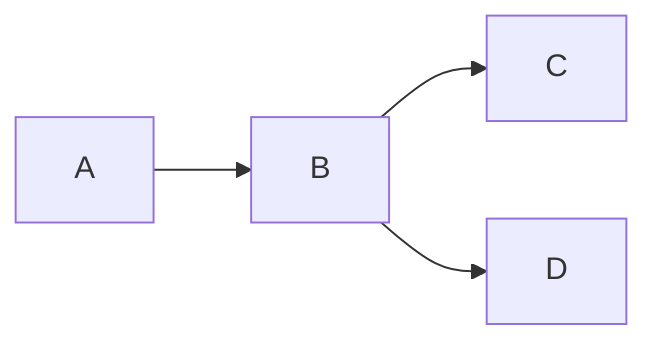

# 以来源会话承载消息树，按父消息关系共享分叉前缀

每个 Palace 对话对应一个由来源网站与 `session_id` 标识的来源会话；对话内容按一条消息一条记录持久化，以 `parent_message_id` 形成树。标题属于 Palace 可编辑元数据，原始网页链接由受控来源模板生成，不保存用户提供的任意 URL；轮次只在展示时派生。

当前为 `implemented`，服务端契约已实现并验证；核心测试用例分别记录直接证据及仍属于展示端、设备交互或导出的后续验证边界。本文件是所属领域的根决策，没有前序 ADR。第一版建立新模型，不承担既有生产数据的自动迁移义务，也不承诺从 Web Chat 网站发现或导出对话。

## 范围与依赖

拥有 `conversation`、`message` 两张表。用户提交数据的校验、事务和重复导入规则由[用户提交线性路径导入](../import/0-user-submitted-linear-path.md)负责；未来跨端复制遵循[客户端时间戳 LWW 与全局序列同步](../sync/0-client-timestamp-lww-and-global-seq.md)。[Owner 与数据隔离](../owner/0-authelia-identity-and-owner-scoped-records.md)将第一版授权范围固定为 Owner Scope；共享知识库与成员权限仍未确定。

## 问题与约束

同一个 Web Chat 对话可能存在 `A-B-C` 与 `A-B-D` 两条路径，其中 A、B 是共享前缀。消息角色不保证严格交替：用户可能在 assistant 回答前中止请求并继续发送消息，对话也可能以 user 消息结束。因此，整段 Markdown 或固定一问一答都不能作为稳定的持久化单位。

现有导出样本也不提供统一的来源节点身份：ChatGPT 样本包含 `turnId`、`turnNumber`，Gemini 与 Grok 样本只有 `role`、`content`。跨来源核心模型不能依赖将被忽略的额外字段。

## D1：来源与 session_id 共同标识原始会话

| 表 | 主要字段 | 关键规则 |
| --- | --- | --- |
| `conversation` | `owner_id uuid`, `title`, `source`, `session_id` | source 第一版为 chatgpt/gemini/grok；同一 Owner Scope 内 `(source, session_id)` 唯一 |
| `message` | `conversation_id uuid`, `parent_message_id? uuid`, `role`, `content` | role 为 user/assistant；content 保存原始 Markdown；父消息必须属于同一对话 |

`session_id` 是来源网站分配的外部身份，不单独全局唯一，也不作为 Palace 主键。`conversation.id` 与 `message.id` 使用 Palace 自己生成的稳定身份，不能因标题、内容或来源网页路径变化而替换。Conversation、Message 均按 Owner 根决策携带 `owner_id`。

标题由用户填写，是 Palace 内的可编辑显示信息，不参与来源会话匹配。同一 Owner Scope 再次导入相同 `(source, session_id)` 时定位已有 Conversation，而不是仅因标题不同创建另一份来源会话。

## D2：原始链接由受控模板生成

第一版只接受规范枚举值，不接受用户提交来源域名或完整原始链接。服务端按 source 选择受控模板，将经过路径段校验和编码的 `session_id` 替换 `{session_id}` 后生成跳转地址：

| source | 第一版模板 |
| --- | --- |
| chatgpt | `https://chatgpt.com/c/{session_id}` |
| gemini | `https://gemini.google.com/app/{session_id}` |
| grok | `https://grok.com/c/{session_id}` |

模板是可更新的产品配置，不是来源会话身份。模板调整只改变以后生成的链接，不改写 `source`、`session_id` 或 Palace ID。跳转只帮助用户返回其原始网页，不表示 Palace 能验证该页面存在、拥有访问权限或与已导入内容仍然一致。

## D3：一条消息一条记录，以父消息形成树

`parent_message_id` 表示当前消息直接跟随的上一条消息；首条消息为空。Conversation 自身是全部首条 Message 的虚拟根，因此两条路径从第一条消息就不同时仍属于一棵对话树。一个 Message 最多有一个父消息，可以拥有多个子消息。同一 Conversation 内没有分叉时是一条链，有多个子消息时自然形成分叉。

Message 是存储、搜索、引用和分叉的最小单位。user 与 assistant 内容长度明显不同不改变模型：`text` 是变长内容，不能为了减少短消息记录而把多条消息塞回一个字段。

对话树不要求 user/assistant 交替，不要求一条路径由 assistant 结束，也不根据角色推断父子关系。第一版导入数组中的相邻顺序提供父子关系；后续原生分叉格式或 Palace 内编辑仍必须显式产生稳定的父子关系。

## D4：路径由叶子及其祖先确定，不另存整段 Markdown

一个 Path 由末端消息沿 `parent_message_id` 回溯到根部得到。共享前缀消息只保存一次，C、D 等后缀分别挂在最后一个共享消息下。第一版不创建包含消息数组或整段 Markdown 的重复路径正文。

读取完整路径时必须检查父链无环且始终属于同一 Conversation。需要列出所有分叉时，从根节点展开子节点；兄弟节点的稳定展示顺序使用持久化创建顺序和 ID 打破平局，不把该顺序解释为对话先后关系。

## D5：轮次是展示分组，不是持久化身份

“一问一答”、连续到某条 assistant 消息为止等分组都无法覆盖中止回答、连续 user、连续 assistant 和分叉发生在消息之间的情况。第一版不建立 `turn` 表，也不在一条记录内部保存消息数组。

界面可以按角色连续性或 assistant 结束位置生成视觉轮次，但该分组不参与消息身份、去重、父子关系或同步冲突。若以后来源提供了跨平台稳定且产品确实需要的轮次语义，应新增 ADR，不把现有消息树事后猜测为来源轮次。

## 为什么不是这些替代方案

| 替代方案 | 优势 | 本次取舍 |
| --- | --- | --- |
| 整个对话保存为一个 Markdown/JSON 字段 | 写入和读取单路径简单 | 共享前缀重复、局部搜索和引用困难，任何分叉或小改动都重写整段内容 |
| 一问一答保存一条记录 | UI 展示直观 | 角色不严格交替，无法表达未回答 user 消息及连续消息 |
| 每遇到 assistant 结束保存一个消息数组 | 记录数量较少 | 边界由消息角色偶然决定，分叉、引用和更新仍需定位记录内部元素 |
| 独立 Branch 表并复制完整消息序列 | 每条路径读取简单 | A、B 等共享前缀重复，修正和标注可能在副本间分歧 |
| 依赖来源 turnId 作为消息身份 | ChatGPT 样本可直接利用 | Gemini、Grok 样本没有统一字段，且第一版约定忽略额外字段 |

## 不变量

1. 来源会话身份由 Owner Scope、source 与 session_id 共同确定，标题不参与身份匹配。
2. 原始链接只由受控 source 模板与经校验的 session_id 生成。
3. Conversation 是虚拟根；每条 Message 至多一个父消息，父子消息属于同一 Conversation，父链无环。
4. 消息角色不必交替，对话路径不必以 assistant 结束。
5. 分叉路径共享已确认的相同前缀，不复制整段对话正文。
6. 轮次不承担第一版持久化身份、导入边界或同步冲突语义。

## 风险与为什么不能直接改写

如果先按整段正文或轮次数组存储，再引入分叉与消息级引用，需要拆分既有内容并猜测每条消息的稳定身份和父子关系；仅靠角色和文本不能无损恢复这些信息。消息父子关系投入使用后也不能通过批量重排或内容相似度直接改写，否则既有路径、引用与导入头会改变含义。需要纠错时必须保留明确映射或重建对应路径。

来源网站可能改变页面路由，用户也可能删除原始会话或失去权限。链接模板更新不能被解释为来源内容迁移；Palace 保存的导入内容仍是本系统内的知识记录。

## 本决策未解决的问题

- 知识库空间、共享与成员权限：第一版归属已由 Owner 决策确定，共享仍待后续决定。
- 消息正文编辑、合并、引用与标注：需要明确共享前缀被修改时的产品语义后另定。
- 附件、图片、工具调用、模型名称和来源额外字段：第一版不进入核心消息模型。
- 搜索索引、向量化、Markdown 渲染组件和内容大小限制：在实现与安全决策中确定。

## 落地与验收

来源身份、受控链接、消息树、祖先路径和标题原位编辑均已落地。树关系在数据库中不可改写，父节点必须先存在；复合外键与写入约束拒绝跨 Owner、跨 Conversation 和环。连续同角色、共享前缀及不同首节点由单元测试和真实 PostgreSQL 导入测试验证。正文与结构编辑仍未开放。

运行 `task test` 验证默认单元测试与 lint；`task test:integration`、`task test:contract` 显式运行默认忽略的容器测试。具体职责、接口、容量和部署配置见[运行文档](../../../../docs/README.md)，验证证据见对应领域核心测试用例。
